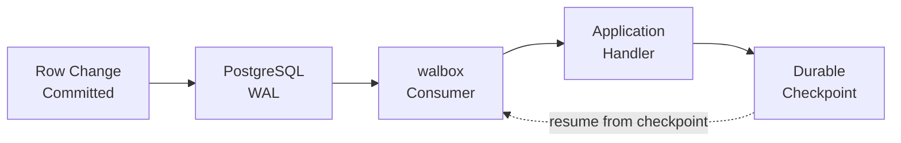

<p align="center">
  
</p>

<p align="center">
  Async Python runtime for consuming PostgreSQL logical replication as a stream of committed transactions.
</p>

<p align="center">
    <a href="https://github.com/mochams/walbox/actions">
        
    </a>
    <a href="https://pypi.org/project/walbox/">
        
    </a>
    <a href="https://pypi.org/project/walbox" target="_blank">
        
    </a>
</p>

Publish a table in PostgreSQL, and walbox streams every committed change out of it as a durable, at-least-once feed.

walbox delivers each transaction at least once, resumes from a durable checkpoint after any restart, and applies backpressure instead of buffering without limit when your handler falls behind. See [Introduction](getting-started/introduction.md) for the full list of guarantees and where walbox's limits are.

## How it works



1. Write to any table covered by your publication
2. walbox receives the change via logical replication
3. Your handler processes it (publishes to a broker, writes to another system, etc.)
4. Once successful, walbox saves a durable checkpoint
5. On restart, walbox resumes from the last durable checkpoint.

## Install

```bash
pip install walbox
```

See [Getting Started](getting-started/introduction.md) for setup, or jump to [Examples](examples/transactional-outbox.md) for production patterns.

## Requirements

- **Python 3.13+**
- **PostgreSQL 14+**
- **Psycopg 3**

By default, Psycopg uses your system's libpq. If you don't have libpq installed, Psycopg can use its own bundled version. See [Getting Started](getting-started/introduction.md) for details.

---

**Next**: [Getting Started](getting-started/introduction.md) · [Production Guide](production/architecture.md) · [Examples](examples/transactional-outbox.md)
