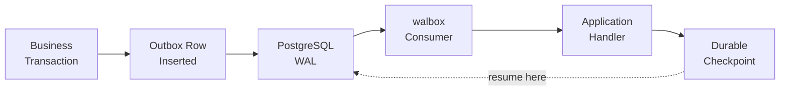

<p align="center">
  
</p>
<p align="center">
    Async Python runtime for consuming PostgreSQL logical replication as a stream of committed transactions, built for the transactional outbox pattern.
</p>

<p align="center">
    <a href="https://github.com/mochams/walbox/actions">
        
    </a>
    <a href="https://pypi.org/project/walbox/">
        
    </a>
    <a href="https://pypi.org/project/walbox" target="_blank">
        
    </a>
</p>

---

**Documentation**: <a href="https://mochams.github.io/walbox/" target="_blank">https://mochams.github.io/walbox/</a>

**Source Code**: <a href="https://github.com/mochams/walbox" target="_blank">https://github.com/mochams/walbox</a>

---

# walbox

Write an outbox row in the same database transaction as your business data, then stream those committed inserts to an external system with no polling and no `LISTEN`/`NOTIFY`.

**At-least-once delivery** with a durable local checkpoint. **Bounded delivery queue** to apply backpressure when handlers fall behind. **Reconnects and resumes** automatically from the last checkpoint. **Graceful shutdown** that lets in-flight work finish before exiting. **Asyncio-native**, one Python dependency.

## How it works



1. Write your business data and an outbox row in the same PostgreSQL transaction
2. walbox receives the change via logical replication
3. Your handler processes it (publishes to a broker, writes to another system, etc.)
4. Once successful, walbox saves a durable checkpoint
5. On restart, walbox resumes from the checkpoint with no data loss

## Install

```bash
pip install walbox
```

See [Getting Started](getting-started/introduction.md) for setup, or jump to [Examples](examples/transactional-outbox.md) for production patterns.

## Requirements

- **Python 3.13+**
- **PostgreSQL 14+**
- **Psycopg 3** (included with `pip install walbox`)

By default, Psycopg uses your system's libpq. If you don't have libpq installed, Psycopg can use its own bundled version — see [Getting Started](getting-started/introduction.md) for details.

---

**Next**: [Getting Started](getting-started/introduction.md) · [Production Guide](production/architecture.md) · [Examples](examples/transactional-outbox.md)
